# Gig Coordinator

> Mobilna PWA do koordynacji pracy dorywczej w zespołach — organizatorzy ogłaszają jednorazowe wydarzenia, pracownicy zapisują się z telefonu, system pilnuje slotów, listy rezerwowej i priorytetów po randze.

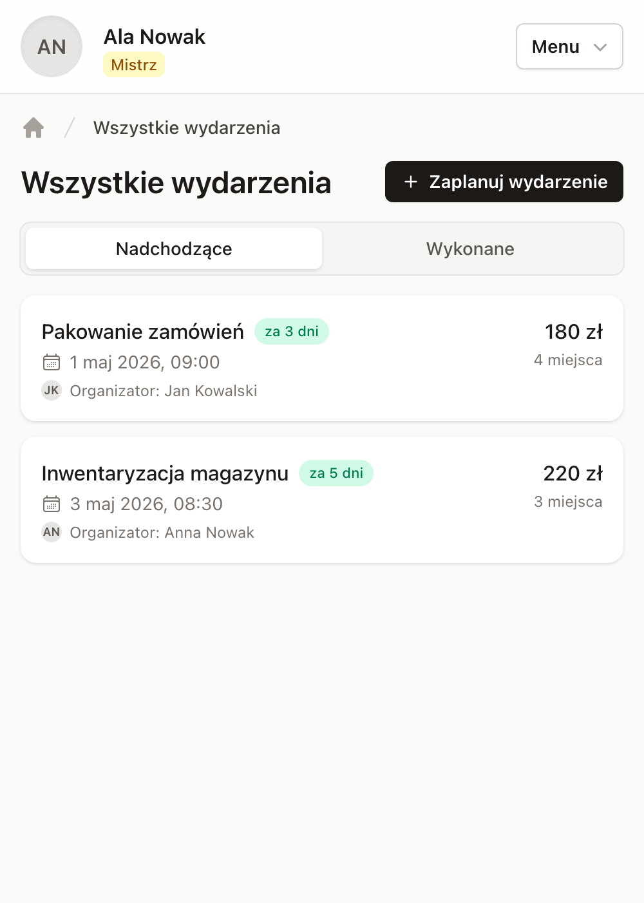

---

## Spis treści

- [Co to robi](#co-to-robi)
- [Główne funkcje](#główne-funkcje)
- [Stack](#stack)
- [Uruchomienie lokalnie](#uruchomienie-lokalnie)
- [Architektura](#architektura)
- [Komendy](#komendy)
- [Deployment](#deployment)

---

## Co to robi

**Gig Coordinator** rozwiązuje konkretny problem: koordynację jednorazowych, krótkoterminowych wydarzeń, na które potrzeba grupy ludzi.

- **Organizator** (`Host`) tworzy wydarzenie — data, godzina rozpoczęcia, czas trwania, liczba miejsc, stawka.
- **Pracownik** (`User`) z PWA na telefonie widzi feed wydarzeń, klika „Akceptuję" i zostaje zapisany.
- **System** pilnuje liczby slotów (atomowo, pod blokadą), promuje z listy rezerwowej, wysyła powiadomienia push i e-maile, daje priorytetowe zaproszenia najwyższej randze użytkowników z 1-godzinnym deadline'em.

Cały interfejs jest zaprojektowany pod telefon (`max-w-lg`, sticky navbar, `<el-dropdown>` popover menu, animacje Tailwind v4). PWA instaluje się jak natywna aplikacja, działa offline (service worker), wysyła powiadomienia push.

---

## Główne funkcje

### Logowanie 5-cyfrowym kodem (bez magic-linków)

Magic-linki zostały świadomie wyrzucone, bo tapnięty w mailu link otwierał systemową przeglądarkę zamiast zainstalowanej PWA i ciasteczko sesji lądowało w złym kontekście. Zastąpione 5-cyfrowym kodem, który wpisuje się w PWA — sesja zostaje w tym samym kontekście, który ją wystawił.

5 oddzielnych pól na cyfry, sterowane przez Stimulus controller (auto-focus do przodu, backspace cofa, paste rozdziela cyfry, auto-submit po wypełnieniu).

| Ekran logowania | Wpisanie kodu |
|---|---|
| 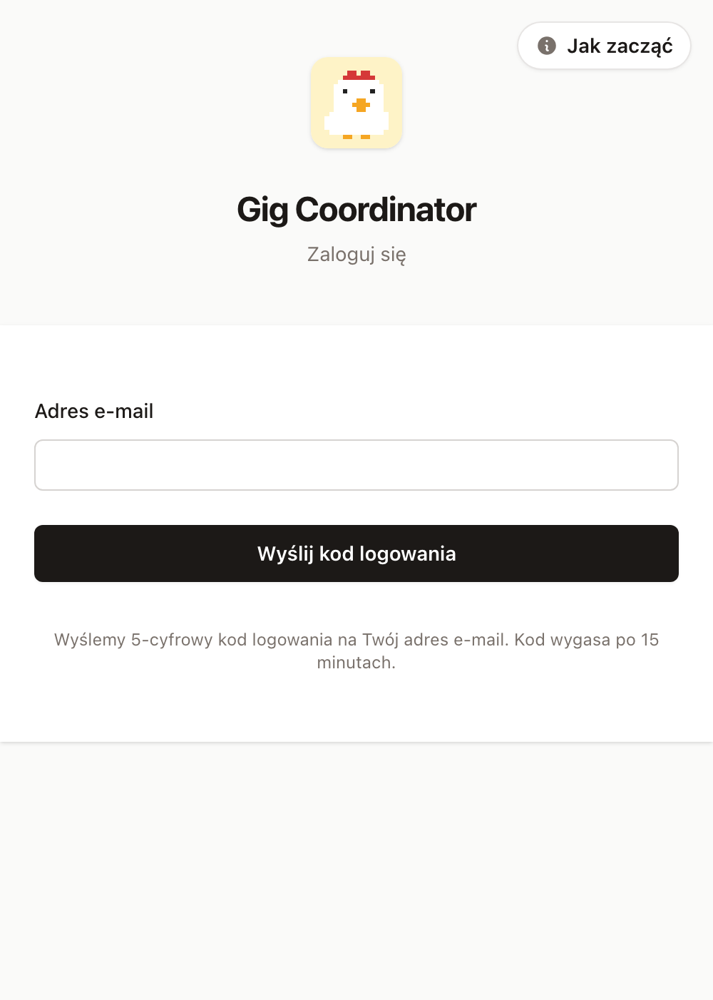 | 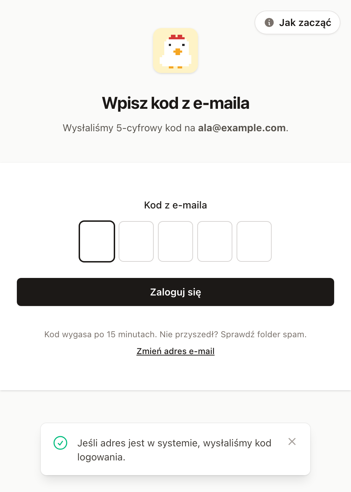 |

### Feed wydarzeń + real-time updates

Lista nadchodzących wydarzeń. Subskrybuje się do globalnego strumienia `:events` przez Turbo Stream — kiedy ktoś tworzy nowe wydarzenie, każdy zalogowany pracownik widzi je w feedzie bez odświeżania.

Custom Turbo Stream action `visit` — gdy organizator publikuje event, każdy podłączony pracownik dostaje `Turbo.visit(url)` i zostaje przeniesiony bezpośrednio na stronę wydarzenia.


### Stan zapisów + capacity-aware UI

Liczba zajętych miejsc / capacity widoczna od razu. Wydarzenie pełne dostaje wizualny ring + chip „pełne". Lista rezerwowa pokazuje pozycję w kolejce.

Capacity math: **rezerwacje + potwierdzeni** trzymają slot. Predykat `Event#full?` to wlicza, więc regularny użytkownik zobaczy „pełne" nawet gdy slot jest tylko zarezerwowany dla wyższej rangi (still pending).

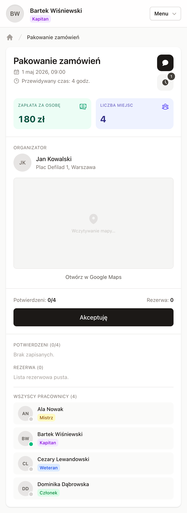

### System rang i tytułów

5-poziomowa hierarchia (`enum :title`) z kolorowymi pillami:

| Ranga | Kolor | Uprawnienia |
|---|---|---|
| Nowy (`rookie`) | szary | tylko zapisy |
| Członek (`member`) | zielony | tylko zapisy |
| Weteran (`veteran`) | niebieski | tylko zapisy |
| Kapitan (`captain`) | fioletowy | może tworzyć wydarzenia dla **przypisanych organizatorów** |
| Mistrz (`master`) | złoty | może tworzyć wydarzenia dla **dowolnego organizatora**, dostaje priorytetowe zaproszenia |

Awans przez `rails console` (`u.update!(title: :master)`). Złota ranga zarezerwowana dla najwyższego tieru — single source of truth: `User#can_create_events?`.

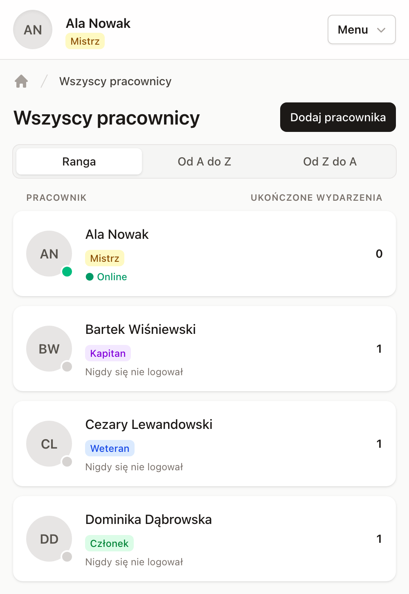

### Priorytetowe rezerwacje (1h deadline)

Gdy `Mistrz` istnieje w systemie, każde nowe wydarzenie **rezerwuje sloty wyłącznie dla Mistrzów** (hard-coded, bez kaskady na niższe rangi). Każdy zaproszony Mistrz dostaje:

- **InvitationMailer** (e-mail z buttonem)
- **WebPushNotifier** (push z dźwiękiem)
- **`reserved_until`** (1 godzina od stworzenia)

Na stronie wydarzenia widzi dedykowany banner + Akceptuję / Odrzuć. Akceptacja przekłada `reserved → confirmed`. Odrzucenie wywołuje `ReservationService.refill_one(event)` — najpierw ktoś z listy rezerwowej dostaje awans, a dopiero potem inny Mistrz dostaje zaproszenie.

`ReservationExpirationJob` (recurring co minutę przez Solid Queue) sweepuje wygasłe rezerwacje i przepuszcza je przez ten sam refill-flow.

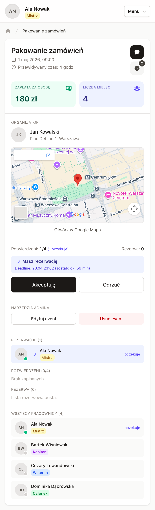

### Web push notifications (VAPID)

Powiadomienia push działają na iOS (Safari/PWA) i Androidzie (Chrome/FCM):

- **Nowe wydarzenie** → push do każdego pracownika
- **Awans z listy rezerwowej** → push do konkretnego usera
- **Zaproszenie priorytetowe** → push z 1h deadline
- **Wydarzenie zakończone** → push z podsumowaniem

VAPID `sub` musi być routowalnym mailem — Apple Push odrzuca JWT z fake mailto.

### Panel organizatora

Osobny layout (`host_admin.html.erb`, `max-w-3xl`), nawigacja nad i pod treścią, breadcrumbs. Routes namespace'owany jako `/panel/eventy/...` (Host model konfliktował z Zeitwerkiem — controllers żyją pod `HostAdmin::`, mapowane przez `namespace :host, path: "panel", module: "host_admin"`).

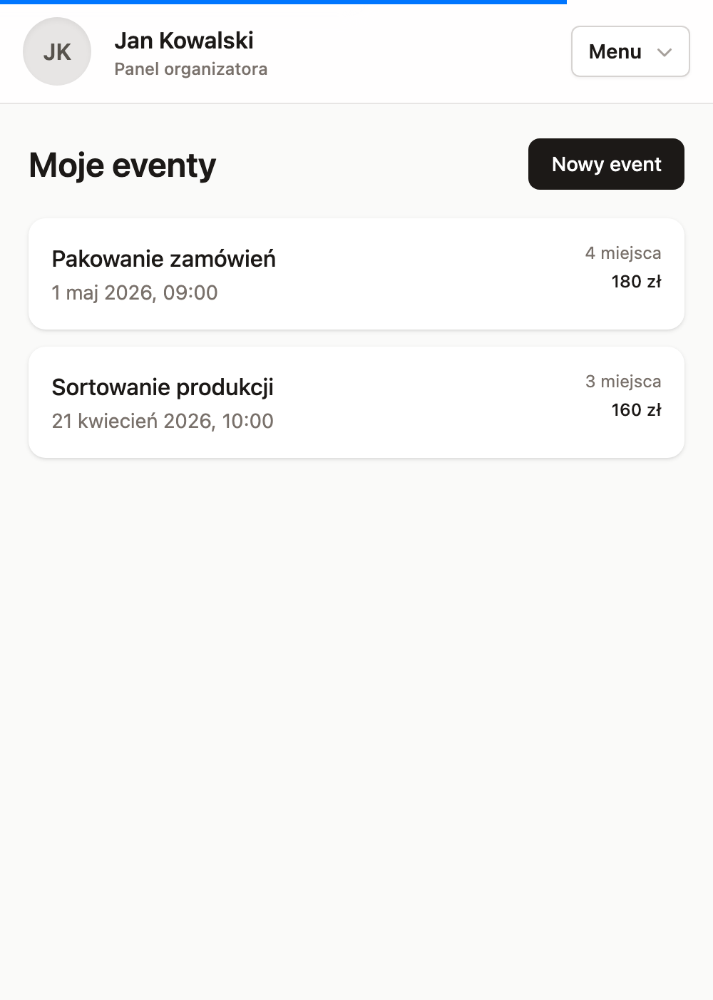

### Profil + Active Storage

Każdy user ma `has_one_attached :photo` z preprocessowanym wariantem `:small` (100×100, webp, quality 88). Generowany on-attach przez Solid Queue, więc pierwszy request nie płaci za transcode.

Avatar serwowany przez `rails_representation_path` (path helper, nie URL helper) — działa też w broadcastach Turbo Stream z kontekstów non-HTTP (background jobs, recurring tasks, `bin/rails runner`).

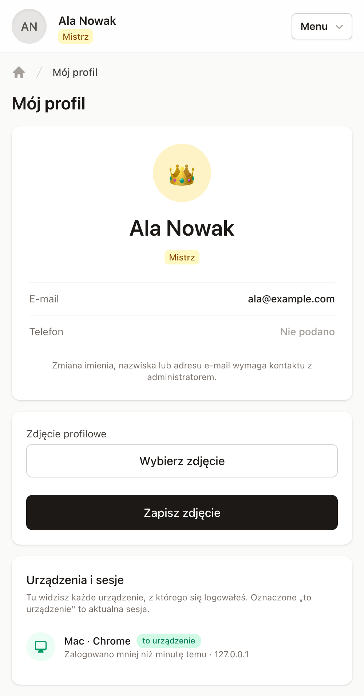

### Czat wydarzeniowy + historia

Każde wydarzenie ma własny czat (Turbo Streams), zapisani uczestnicy mogą wysyłać wiadomości. Po zakończeniu wydarzenia — historia w osobnej zakładce, z miniaturkami uczestników.

| Czat | Historia |
|---|---|
| 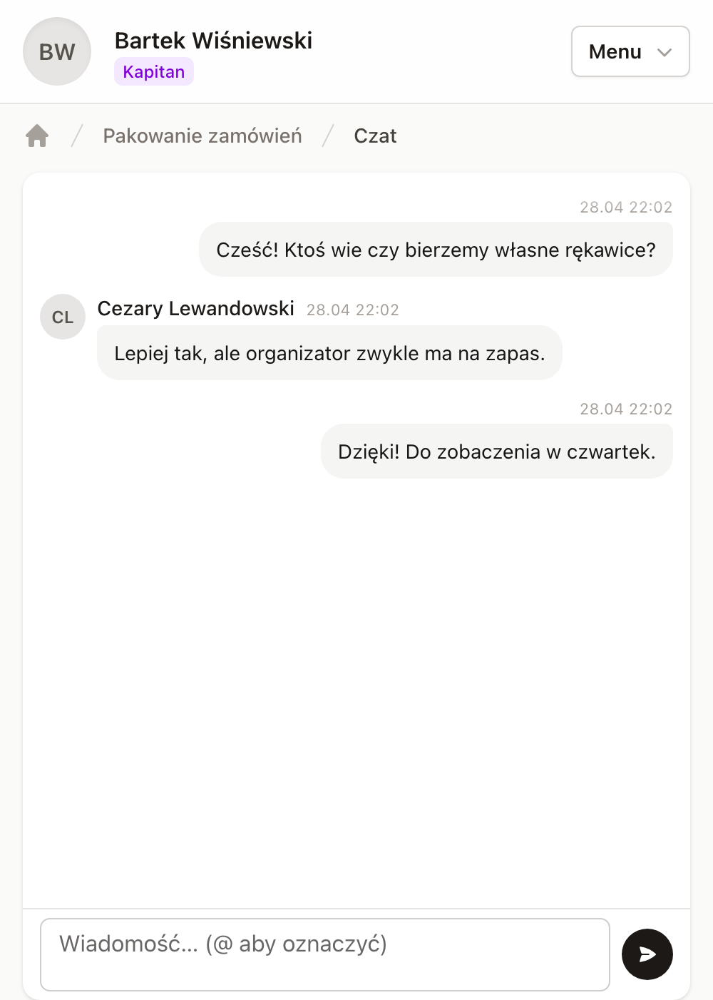 | 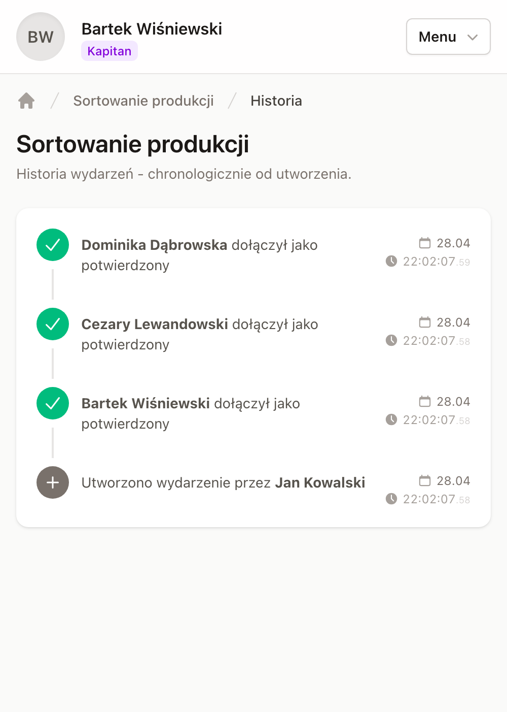 |

### Lista pracowników + organizatorów

Globalne listy `/pracownicy` i `/organizatorzy`. Pracownicy posortowani po randze (DESC) potem alfabetycznie, z licznikiem ukończonych wydarzeń. Organizatorzy z avatarem, lokalizacją i licznikiem nadchodzących wydarzeń.

| Pracownicy | Organizatorzy |
|---|---|
|  | 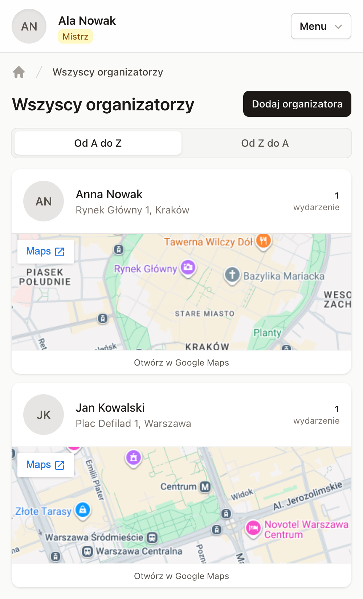 |

---

## Stack

- **Rails 8.1**, **Ruby 4.0**
- **SQLite** + Active Storage (przechowywanie zdjęć)
- **Hotwire** — Turbo (Streams + Frames) + Stimulus controllers
- **Tailwind v4** (watcher w Procfile.dev, custom keyframes w `@theme`)
- **`@tailwindplus/elements`** (dropdown web-components, importmap)
- **Solid Queue** (jobs in-Puma), **Solid Cache**, **Solid Cable** (websocket bez Redisa)
- **web-push** (VAPID)
- **rails-i18n** (polska lokalizacja + transliteracja slugów `parameterize`)
- **Kamal 2** (deployment)
- **Brakeman**, **RuboCop**, **bundler-audit** (CI)

---

## Uruchomienie lokalnie

```bash
bin/setup                            # bundle + db:prepare
bin/dev                              # Puma + tailwindcss:watch (honoruje $PORT)
PORT=3001 bin/dev                    # inny port (gdy :3000 zajęty)
bin/rails db:seed                    # idempotentne seedy: hosty, użytkownicy, wydarzenia
bin/login-code <email>               # wygeneruj 5-cyfrowy kod (w dev jest też w stdout `bin/dev`)
```

### Wymagane credentials (`rails credentials:edit`)

```yaml
google:                              # Gmail SMTP (App Password, nie zwykłe hasło)
  user_name: foo@gmail.com
  password:  <16-znakowe-app-password>
vapid:                               # generowany raz przez WebPush.generate_key
  public_key:  ...
  private_key: ...
  subject: mailto:<deliverable-email>
```

`config/master.key` jest gitignored, `config/credentials.yml.enc` commited.

---

## Architektura

### Dwa odrębne modele autentykowane

`Host` i `User` to oddzielne ActiveRecord models (nie STI, nie pojedyncza kolumna `role`). Oba mają polimorficzne `Session`-y i `LoginCode`-y. `User` dodatkowo ma `enum :title` z 5 rangami.

### State machine zapisów

`Participation` — `status: { confirmed: 0, waitlist: 1, cancelled: 2, reserved: 3 }`. Create/destroy/accept/decline atomowe pod **pessimistic lock na Event**:

```ruby
Event.transaction do
  event.lock!
  # czytaj counts, decyduj confirmed vs waitlist
end
```

### Turbo Stream broadcasts (model-level)

Refresh listy uczestników i licznika idą z **callbacka modelu `Participation`**:

```ruby
after_commit :broadcast_event_updates, on: %i[create update destroy]
```

Każda ścieżka, która rusza participation — kontroler, service, recurring job, `rails console` — odświeża otwarte browsery automatycznie. Single source of truth.

### 4 strumienie Turbo

| Strumień | Subskrypcja | Broadcast on |
|---|---|---|
| `[event, :counts]` | event show page | model callback (uczestnictwo CRUD) |
| `[event, :roster]` | event show page | model callback |
| `:events` | feed (`/`) | Event create/update/destroy |
| `[user, :events]` | feed (zalogowany user) | rezerwacja invite (replace card) |

### Custom Turbo Stream action `visit`

```js
Turbo.StreamActions.visit = function () {
  Turbo.visit(this.getAttribute("target"))
}
```

Server emituje `<turbo-stream action="visit" target="/eventy/42-xyz">` — handler robi pełną nawigację. Używane gdy organizator tworzy wydarzenie i każdy pracownik na feedzie zostaje przeniesiony do nowego eventu.

### Active Storage z preprocessed variant

```ruby
has_one_attached :photo do |attachable|
  attachable.variant :small,
    resize_to_limit: [100, 100],
    format: "webp",
    saver: { quality: 88 },
    preprocessed: true
end
```

Wariant generowany na attach przez Solid Queue. Każdy avatar w aplikacji (roster, listy, navbar, profil) leci z tego samego 100×100 webp.

### Solid Cable w dev + prod

`config/cable.yml` używa `solid_cable` w obu środowiskach — domyślny async adapter Railsa propagował broadcasty tylko wewnątrz jednego procesu, więc `bin/rails runner`/`rails console` nie docierał do podłączonych browserów. Z `solid_cable` każdy proces (włącznie z background jobs i ad-hoc consolą) trafia do żywych WebSocketów.

---

## Komendy

```bash
bin/dev                                       # Puma + Tailwind watch
bin/rails db:migrate                          # migracje
bin/rails db:seed                             # idempotentne seedy
bin/rails test                                # unit + integration
bin/rails test:system                         # Capybara + headless Chrome
bin/rails test test/models/host_test.rb       # pojedynczy plik
bin/rails test test/models/host_test.rb:24    # pojedynczy test (po linii)
bin/rubocop                                   # styl
bin/brakeman                                  # security scan
bin/login-code <email>                        # wygeneruj 5-cyfrowy kod
bin/ci                                        # pełny pipeline CI
```

---

## Deployment

Kamal 2 — buduje obraz lokalnie, pushuje do registry, rolluje na VPS-ie. Persistent volume na SQLite + Active Storage blobs.

```bash
kamal setup       # tylko pierwszy raz
kamal deploy      # build + push + roll
kamal app logs -f # logi
kamal console     # rails console na produkcji
kamal shell       # ssh do kontenera
```

Konfiguracja w `config/deploy.yml`. Sekrety w `.kamal/secrets` (czyta z gitignored plików, nie zawiera raw values).
